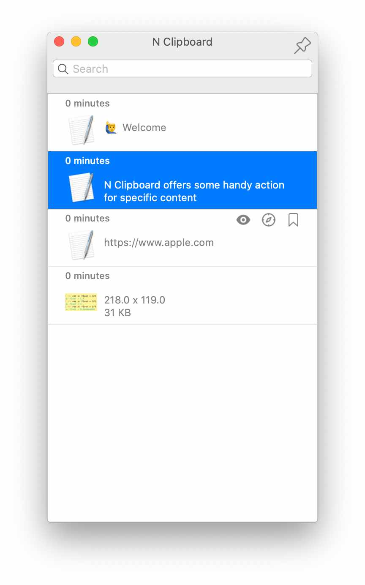

### N Clipboard



### System Requirement
| Since this application is built on top of `SwiftUI`, so the least required system version is `macOS Catalina(10.15+) and above`

### Installation

#### from our release 
You can download dmg installer from the [releases](https://github.com/poor-branson/N-Clip-Board/releases)

#### compile from source

- Fork the master(release) into your local.
- The least required xcode environment version is `11`
- Under the project root, execute
```shell
npm i && make
```
- Then, you could find installer under `build/`